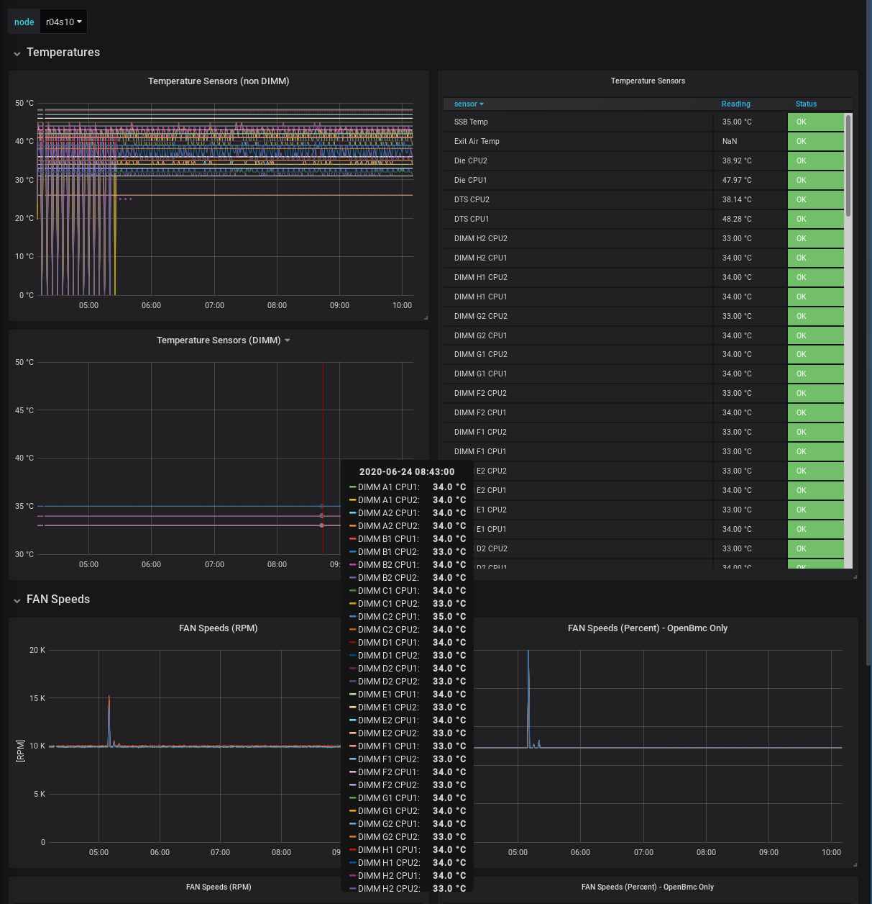

Telemetry Connectors for OpenBmc Distribution
=============================================

OpenBmc telemetry integration examples with popular telemetry systems like Prometheus, Telegraf.

Prometheus Integration
======================

Prometheus servers can use OpenBmc Prometheus Exporter to collect telemetry from OpenBmc Redfish endpoints.

Navigate to [prometheus-exporter](/prometheus-exporter/) directory to get deployment instructions.

Grafana Dashboard Examples
==========================
Naviage to [grafana](/grafana/) directory to get deployment instructions.

Telegraf
========
Currently only the Prometheus code is available.
