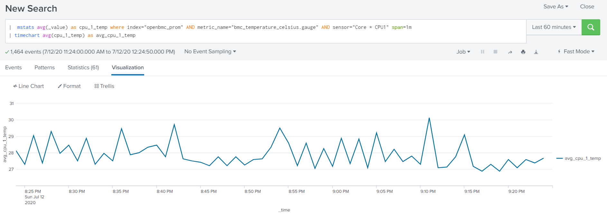

DISCONTINUATION OF PROJECT

This project will no longer be maintained by Intel.

Intel has ceased development and contributions including, but not limited to, maintenance, bug fixes, new releases, or updates, to this project.  

Intel no longer accepts patches to this project.

If you have an ongoing need to use this project, are interested in independently developing it, or would like to maintain patches for the open source software community, please create your own fork of this project.  

Contact: webadmin@linux.intel.com
Telemetry Connectors for OpenBmc Distribution
=============================================

OpenBmc telemetry integration examples with popular telemetry systems like Prometheus, Telegraf.

Prometheus Integration
======================

Prometheus servers can use OpenBmc Prometheus Exporter to collect telemetry from OpenBmc Redfish endpoints.

Navigate to [prometheus-exporter](/prometheus-exporter/) directory to get deployment instructions.

Grafana Dashboard Examples
==========================
Naviage to [grafana](/grafana/) directory to get deployment instructions.

Splunk via Telegraf
===================

Naviage to [splunk](/splunk/) directory to get deployment instructions.

