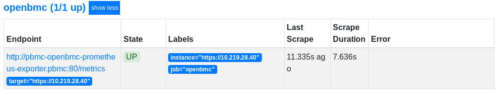

Prometheus exporter for OpenBmc telemetry
=========================================

Deployment instructions.
------------------------

1.  Build Docker image
    
    Currently this repo does not build Docker images automatically.\
    Use following commands to build your Docker image:
    ```
    cd service-code
    # build Docker image
    docker build -t your-local-registry/prometheus-openbmc-exporter:latest .
    # push Docker image to your local registry
    docker push your-local-registry/prometheus-openbmc-exporter:latest
    ```

2.  Deploy the Prometheus Exporter to your Kubernetes cluster
    
    This repo includes a Helm chart that can be used to deploy the Prometheus exporter service.\
    Create a file with credentials to BMC. For security reasons, credentials need to be specified for every node separately.

    Example deployment:
    
    ```
    helm upgrade \
          -i pbmc \
          --namespace pbmc \
          -f deployment-example-credentials-file.yaml \
          --set image.repository=your-local-registry/prometheus-openbmc-exporter:latest \
          ./deployment-helm-chart/
    ```

3.  Configure Prometheus server. Example static configuration:
    
    ```
      - job_name: 'openbmc'
        metrics_path: /metrics
        static_configs:
          - targets:
              - https://node1
              - https://node2
              - https://node3
        relabel_configs:
        - source_labels: [__address__]
          regex: (.+)
          target_label: instance
          replacement: $1
        - source_labels: [__address__]
          regex: (.+)
          target_label: __param_target
          replacement: $1
        - separator: ;
          regex: (.*)
          target_label: __address__
          replacement: pbmc-openbmc-prometheus-exporter.pbmc
          action: replace
    ```

Verify your deployment
----------------------

1.  In the Prometheus server Targets section, you should be able to find your nodes:
     
    

2.  You can also query the exporter itself for your nodes telemetry:

    ```
    export BMC_EXPORTER_SVC=$(kubectl -n pbmc get svc -o jsonpath="{.items[0].spec.clusterIP}")
    curl -s http://$BMC_EXPORTER_SVC/metrics?target=https%3A%2F%2Fnode1 | head -8
    # HELP bmc_temperature_celsius 
    # TYPE bmc_temperature_celsius gauge
    bmc_temperature_celsius{sensor="BMC Temp"} 33.312
    bmc_temperature_celsius{sensor="CPU1 P12V PVCCIN VR Temp"} 39.0
    bmc_temperature_celsius{sensor="CPU1 P12V PVCCIO VR Temp"} 42.0
    bmc_temperature_celsius{sensor="CPU1 VR Mem ABCD Temp"} 32.0
    bmc_temperature_celsius{sensor="CPU1 VR Mem EFGH Temp"} 32.0
    bmc_temperature_celsius{sensor="CPU1 VR P1V8"} 31.0
    ```
