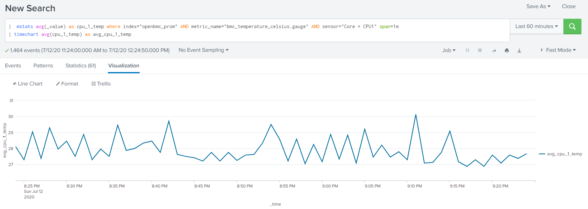

Splunk via Telegraf
===================

Deployment instructions.
------------------------

1.  Prepare Splunk

    - create new metrics index
    - add new HTTP Event Collector
    - copy the newly created Token Value from HTTP Event Collector list

2.  Create [Telegraf](https://hub.docker.com/_/telegraf) configuration file with [Prometheus input plugin](https://github.com/influxdata/telegraf/tree/master/plugins/inputs/prometheus) and [Splunk output plugin](https://github.com/influxdata/telegraf/tree/master/plugins/serializers/splunkmetric)
    
    ```
    docker run --rm telegraf telegraf --input-filter prometheus --output-filter http config > telegraf.conf
    ```

3. Edit configuration file

    - enter Prometheus exporter url: 

        ```
        [[inputs.prometheus]]
        urls = ["http://$BMC_EXPORTER_SVC/metrics?target=https%3A%2F%2Fnode1"]
        ```

    - enter Splunk entries:

        ```
        [[outputs.http]]
        url = "http://SPLUNK_HOST:8088/services/collector"
        data_format = "splunkmetric"
        splunkmetric_hec_routing = true

        [outputs.http.headers]
        Content-Type = "application/json"
        Authorization = "Splunk f8xxxxd3-4xx1-4xx2-aeda-86xxxxxb36c"
        X-Splunk-Request-Channel = "f8xxxxx3-4xx1-4xx2-aeda-8xxxxxxx6c"
        ```
    
        Where "f8xxxxx3-4xx1-4xx2-aeda-8xxxxxxx6c" will be your Token Value

    - enter other settings like interval, hostname, response_timeout, etc.

4. Run Telegraf

    ```
    docker run --add-host BMC_EXPORTER_SVC:BMC_EXPORTER_IP -v $PWD/telegraf.conf:/etc/telegraf/telegraf.conf:ro telegraf
    ```

5. Check results in Splunk

